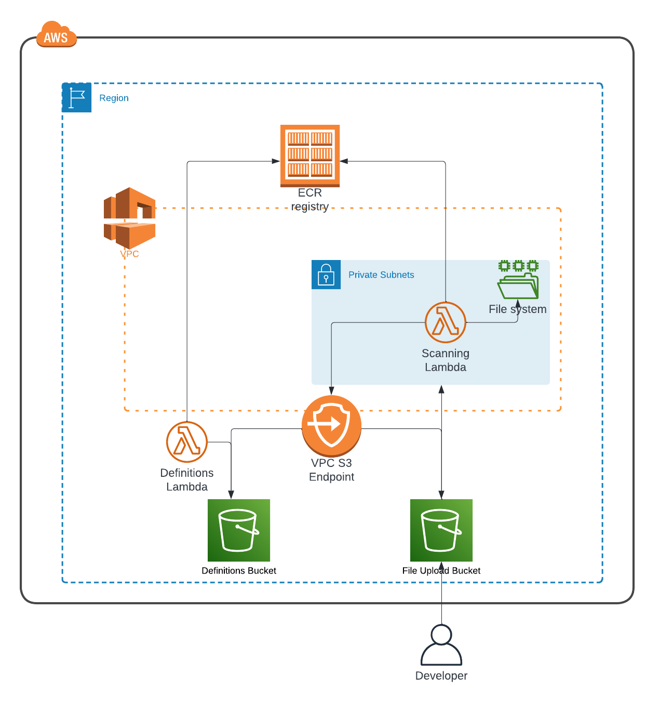

# Devops Challenge
## Table of Contents

- [Introduction](#introduction)
- [Architecture](#architecture)
- [How it works](#how-it-works)
- [The approach to Terraform](#the-approach-to-terraform)
- [To-Do's](#to-do's)

## Introduction
This repository holds the proposal for a solution to create an antivirus scan that reviews files uploaded to an S3 bucket. If an issue is found, the file is deleted from the bucket to prevent any problems.

The reference used to create this was an article found [here](https://aws.amazon.com/blogs/developer/virus-scan-s3-buckets-with-a-serverless-clamav-based-cdk-construct/), with some modifications to have an MVP that provides the basic functionality, as well as outlining further improvements that can be made in iterative efforts.

There were other solutions considered, such as the one outlined in this other article [here](https://aws.amazon.com/blogs/apn/integrating-amazon-s3-malware-scanning-into-your-application-workflow-with-cloud-storage-security/), which also allows scanning of files uploaded to S3. However, this approach requires more resources and possible maintenance. An event-driven approach in combination with serverless solutions like AWS Lambda makes this fast and easy to deploy. Depending on the needs, either solution is viable.

## Architecture

In this repository, there are two main folders: `infrastructure/` and `lambda-code/`, with the latter containing the source code for the two lambdas. The code for the lambdas is based on [this reference](https://github.com/awslabs/cdk-serverless-clamscan/), with some modifications made for logging purposes and to achieve the desired result.

The primary goal of using ECR images is to enable easy maintainability outside of the infrastructure repository. Both source codes would exist in separate repositories, each with pipelines set up to build and push the image to ECR. This approach reduces the amount of changes required for the infrastructure, such as the lambda function, as a single image can be used as the source, and the source code can be maintained separately.

Inside the `infrastructure/` folder, you will find all the Terraform configurations needed to set up this proposed solution. The `network/` directory contains the necessary resources to launch the infrastructure, including one VPC with two private subnets. Additionally, there is an S3 endpoint attached to the VPC. The purpose of this endpoint is to allow access to the S3 Bucket that contains the antivirus definitions used by the Lambda function responsible for scanning.

This image shows the resources that are needed for this first iteration and how they interact with eachother:

## How it works

For the scanning process, this lambda function needs access to two buckets. The first bucket is used for the actual scanning process, and the second bucket is dedicated to holding the necessary configuration files required by the clamav scanner to run. These configuration files need to be hosted privately for security reasons. To enable secure access to these S3 buckets, the VPC endpoint for the S3 service is required. This VPC endpoint allows the lambda function to access the S3 buckets securely without needing to traverse the public internet.

The network configuration for this solution is relatively simple and does not require many resources beyond the two private subnets and the VPC endpoint. The VPC endpoint is attached to the route tables of these private subnets, ensuring that the lambda function can access the S3 service securely within the private network.

By setting up this network configuration and using VPC endpoints, the solution achieves a secure and efficient way to run the scanning process while keeping the configuration files for the clamav scanner privately hosted. This ensures the safety and privacy of the scanning process and the associated data.

## The approach to Terraform

The terraform configuration is meant to showcase several options available to configure Terraform while maintaining standards needed to keep the Terraform configuration easy to maintain.

**Isolation of resources by usage:** The resources in the `infrastructure/` folder are organized into directories meant to separate and group resources that serve a shared purpose. For example, the `network/` directory holds only networking resources, which are resources that do not have a predefined single usage and can be shared with several AWS services. On the other hand, we have the `apps/` folder, where resources are launched to serve a specific end. For instance, the `s3-clamav-scanner` is an example of resources that are grouped due to the purpose they share. This approach facilitates replicating resources across regions and environments with ease.

**Modularization:** The Terraform configuration utilizes several modules to bring up all the necessary resources, including custom-made modules and official AWS modules available via the Terraform registry. Additionally, the root modules are designed for reusability by leveraging Terraform workspaces and var files that can be set during plan/apply stages. This makes it easy and fast to reuse code and avoids the need to duplicate code across the repository.

**Resource Tagging:** Tags are added through provider configuration to all resources created with Terraform, including the path of the directory in which they are being created. This is especially useful when dealing with multiple repositories to configure the infrastructure or when the repository grows over time, and locating the configuration of a file can become cumbersome.

## To-Do's

There are several To-Do's for this MVP version of the solution, and these can be easily set up to make the solution more robust:

1. Add an EventBridge rule to update the antivirus definition files daily, ensuring that the data is always up to date for the antivirus scanning process.

2. Implement a mechanism to automatically add initial definitions into the S3 definitions bucket. Various solutions can be explored to achieve this.

3. Set up an EventBridge Bus and Rules to manage failures of Lambda executions. This will help in monitoring and handling any issues that may occur during the scanning process.

4. Implement a lifecycle rule for S3 log buckets. This will help manage the storage and retention of logs, improving the overall maintenance of the solution.

5. Review and reduce the scope of IAM policies for the S3 buckets and S3 VPC Endpoint. By tightening the permissions, the security of the solution can be enhanced.

6. Update the configuration to utilize outputs from Terraform remote state data sources when available. Leveraging these outputs can improve the efficiency and reliability of the solution.

By addressing these To-Do's, the MVP version of the solution will become more robust, efficient, and secure.